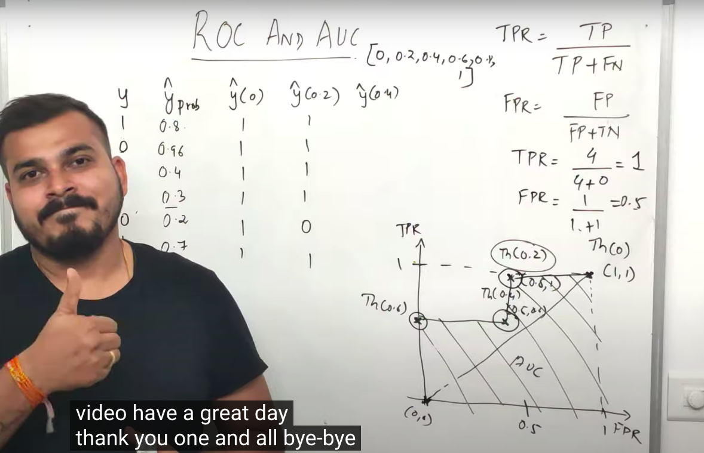

## ROC and AUC

refer: 
- https://www.youtube.com/watch?v=A_ZKMsZ3f3o
- https://developers.google.com/machine-learning/crash-course/classification/roc-and-auc

**Receiver operating characteristic curve (ROC)**
Receiver operating characteristic curve, performance of classification model at all threshold
- T+ve and F+ve

**Area under the curve (AUC)**
1. condiser some threshold value
2. Find output y^ for all threshold values 
3. calculate True+ve and False+ve
4. Plot a graph F+ve vs T+ve

- AUC dir proportional to area
- Model should be always greater than linear line in graph
- Focus on True Positive values
- Select the best threshold value

